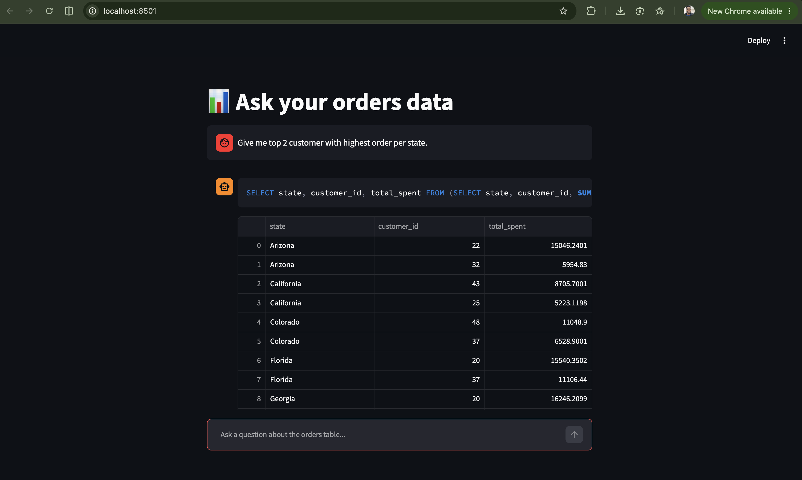

# Ask Your Orders Data



A Streamlit app and CLI demo that generates SQL queries for an `orders` table using Google Gemini via the `google-genai` Python SDK.

## Project overview

- `app.py` is a Streamlit interface where you can ask questions in natural language and get SQL queries plus query results.
- `demo.py` is a simple command-line version for generating SQL and executing it.
- `postgresdb.py` contains the database helper functions used by both apps.
- `req.txt` lists the Python dependencies used by the project.

## Key features

- Enforces model response format with a JSON schema so the output is easier to parse.
- Includes dynamic prompt injection of your `orders` table schema.
- Supports both `SELECT` queries and non-`SELECT` SQL statements.
- Uses a local PostgreSQL database by default.

## Requirements

- Python 3.14+ (or the version supported by your environment)
- PostgreSQL running locally on `localhost:5432`
- A valid Google Gemini API key
- A Python virtual environment

## Setup

1. Create and activate a virtual environment:

```bash
python -m venv myenv
source myenv/bin/activate
```

2. Install dependencies:

```bash
pip install -r req.txt
```

3. Create a `.env` file in the project root with your Google API key:

```env
GOOGLE_API_KEY=your_api_key_here
```

4. Ensure PostgreSQL is running and that your `orders` table exists in the `postgres` database.

> Note: `postgresdb.py` currently connects using:
> - host: `localhost`
> - port: `5432`
> - dbname: `postgres`
> - user: `your_user_name`

If your database connection differs, update `postgresdb.py` accordingly.

## Run the Streamlit app

```bash
streamlit run app.py
```

Then open the browser link shown in the terminal.

## Run the CLI demo

```bash
python demo.py
```

## Troubleshooting

### Error: `Shape of passed values is (2, 1), indices imply (2, 5)`

This can happen if the app tries to build a DataFrame with row/column data in the wrong order. The current code expects `execute_query()` to return `(rows, columns)` for `SELECT` statements.

### Error: `cannot unpack non-iterable int object`

Non-`SELECT` statements return the number of affected rows, not a tuple. The app now handles this separately and shows a summary message.

### Database connection issues

If your database setup is different from the default, edit `postgresdb.py` and update the connection parameters.

## Notes

- The app is configured to use a JSON schema to make the Gemini model output more deterministic.
- The prompt includes the current `orders` schema so the model can generate valid SQL.
- If the app does not auto-reload after saving changes, stop and restart the Streamlit server.
